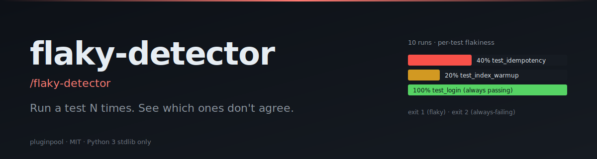

# flaky-detector

**Run your test command N times. Find out which tests don't always agree with themselves.**

[](./LICENSE)
[](https://www.python.org/)
[](https://docs.claude.com/en/docs/claude-code/overview)
[](./tests)

> **TL;DR:** `/flaky-detector --cmd "pytest -v" --runs 10` → per-test flakiness %, sorted worst-first, ready to triage.

#### Writing

**LinkedIn**
- 🗡️ [Çift Yüzlü Katana: Yapay Zeka Dönüşümlerinin Gerçekçi Bir Analizi](https://www.linkedin.com/pulse/%C3%A7ift-y%C3%BCzl%C3%BC-katana-yapay-zeka-d%C3%B6n%C3%BC%C5%9F%C3%BCmlerinin-ger%C3%A7ek%C3%A7i-bir-mehmet-turac-80h7f) — AI transformations realistic analysis. The 5 illusions that compound into expensive, fragile systems.
- 📄 [LinkedIn Articles](https://www.linkedin.com/in/mehmetturac/recent-activity/articles/) — All published articles
- 📊 [LinkedIn Documents](https://www.linkedin.com/in/mehmetturac/recent-activity/documents/) — Research papers and technical documents

**Dev.to**
- [Why AI Agents Fail?](https://dev.to/turacthethinker/why-ai-agents-fail-ddg)
- [We Ship to Production Without Tests. Here's How It Destroyed Us.](https://dev.to/turacthethinker/we-ship-to-production-without-tests-heres-how-it-destroyed-us-i4i)
- [I built a product in one AI session. Here's the system that made it ship right.](https://dev.to/turacthethinker/i-built-a-product-in-one-ai-session-heres-the-system-that-made-it-ship-right-3mb3)
- [Remote Work Didn't Break Productivity — It Broke Human Connection](https://dev.to/turacthethinker/remote-work-didnt-break-productivity-it-broke-human-connection-288o)
- [Hermes vs OpenClaw: Which AI assistant would you actually trust?](https://dev.to/turacthethinker/hermes-vs-openclaw-which-ai-assistant-would-you-actually-trust-bbl)
- [Strategic LLM Adoption: A Director's Guide to Fine-Tuning Models](https://dev.to/turacthethinker/strategic-llm-adoption-a-directors-guide-to-fine-tuning-models-for-domain-specific-applications-4e37)
- [The Context Window Lie: Why Your LLM Remembers Nothing](https://dev.to/turacthethinker/the-context-window-lie-why-your-llm-remembers-nothing-5h1p)
- [Stop Your AI Agent From Building Tools That Already Exist](https://dev.to/turacthethinker/stop-your-ai-agent-from-building-tools-that-already-exist-6o9)
- [Why Versioned SQL Beats Vector RAG for Agent Memory Systems](https://dev.to/turacthethinker/why-versioned-sql-beats-vector-rag-for-agent-memory-systems-1jo3)
- [I Got Access to 136 AI Models for Free — NVIDIA NIM API Deep Dive](https://dev.to/turacthethinker/i-got-access-to-136-ai-models-for-free-nvidia-nim-api-deep-dive-111o)
- [Your Agent Isn't Reflecting. It's Performing Reflection.](https://dev.to/turacthethinker/your-agent-isnt-reflecting-its-performing-reflection-b41)
- [How I Stopped My AI Agent From Reinventing the Wheel](https://dev.to/turacthethinker/how-i-stopped-my-ai-agent-from-reinventing-the-wheel-24eo)


#### Writing

- ✍️ [**Dev.to · TuracTheThinker**](https://dev.to/turacthethinker) — Technical articles on AI, agentic systems, and production engineering
- 📄 [**LinkedIn Articles**](https://www.linkedin.com/in/mehmetturac/recent-activity/articles/) — Industry insights and analysis
- 📊 [**LinkedIn Documents**](https://www.linkedin.com/in/mehmetturac/recent-activity/documents/) — Research papers and technical documents

- 🗡️ [**Çift Yüzlü Katana: Yapay Zeka Dönüşümlerinin Gerçekçi Bir Analizi**](https://www.linkedin.com/pulse/%C3%A7ift-y%C3%BCzl%C3%BC-katana-yapay-zeka-d%C3%B6n%C3%BC%C5%9F%C3%BCmlerinin-ger%C3%A7ek%C3%A7i-bir-mehmet-turac-80h7f) — AI transformations realistic analysis. The 5 illusions that compound into expensive, fragile systems. (LinkedIn, 2026)


## Install (Claude Code)

```sh
git clone https://github.com/mturac/pluginpool-flaky-detector ~/.claude/plugins/flaky-detector
```

Restart Claude Code; the slash command `/flaky-detector` appears.

#### Writing

- ✍️ [**Dev.to · TuracTheThinker**](https://dev.to/turacthethinker) — Technical articles on AI, agentic systems, and production engineering
- 📄 [**LinkedIn Articles**](https://www.linkedin.com/in/mehmetturac/recent-activity/articles/) — Industry insights and analysis
- 📊 [**LinkedIn Documents**](https://www.linkedin.com/in/mehmetturac/recent-activity/documents/) — Research papers and technical documents

- 🗡️ [**Çift Yüzlü Katana: Yapay Zeka Dönüşümlerinin Gerçekçi Bir Analizi**](https://www.linkedin.com/pulse/%C3%A7ift-y%C3%BCzl%C3%BC-katana-yapay-zeka-d%C3%B6n%C3%BC%C5%9F%C3%BCmlerinin-ger%C3%A7ek%C3%A7i-bir-mehmet-turac-80h7f) — AI transformations realistic analysis. The 5 illusions that compound into expensive, fragile systems. (LinkedIn, 2026)


## Quick start

```sh
python3 scripts/flaky.py --cmd "pytest -v" --runs 10 --format md
python3 scripts/flaky.py --cmd "go test ./..." --runs 20 --parallel 4 --out report.json
python3 scripts/flaky.py --cmd "jest --ci" --parser jest --runs 5
```

> Tip: prefer `pytest -v` over `pytest -q` so every result lands on its own line.
> If you use `-q`, flaky-detector still picks up the tail `FAILED path::test` summary
> lines and exits non-zero with a warning rather than reporting a false green.

#### Writing

- ✍️ [**Dev.to · TuracTheThinker**](https://dev.to/turacthethinker) — Technical articles on AI, agentic systems, and production engineering
- 📄 [**LinkedIn Articles**](https://www.linkedin.com/in/mehmetturac/recent-activity/articles/) — Industry insights and analysis
- 📊 [**LinkedIn Documents**](https://www.linkedin.com/in/mehmetturac/recent-activity/documents/) — Research papers and technical documents

- 🗡️ [**Çift Yüzlü Katana: Yapay Zeka Dönüşümlerinin Gerçekçi Bir Analizi**](https://www.linkedin.com/pulse/%C3%A7ift-y%C3%BCzl%C3%BC-katana-yapay-zeka-d%C3%B6n%C3%BC%C5%9F%C3%BCmlerinin-ger%C3%A7ek%C3%A7i-bir-mehmet-turac-80h7f) — AI transformations realistic analysis. The 5 illusions that compound into expensive, fragile systems. (LinkedIn, 2026)


## Flags

| Flag | Default | Description |
|---|---|---|
| `--cmd` | required | The test command (single line, no shell wrapping) |
| `--runs` | `10` | How many times to invoke the command |
| `--parallel` | `1` | Concurrent runs (only safe for parallel-clean suites) |
| `--parser` | `auto` | `pytest`, `jest`, `gotest`, `tap`, or `auto` |
| `--out` | _none_ | Write JSON report to this path |
| `--format` | `json` | `json` or `md` |

#### Writing

- ✍️ [**Dev.to · TuracTheThinker**](https://dev.to/turacthethinker) — Technical articles on AI, agentic systems, and production engineering
- 📄 [**LinkedIn Articles**](https://www.linkedin.com/in/mehmetturac/recent-activity/articles/) — Industry insights and analysis
- 📊 [**LinkedIn Documents**](https://www.linkedin.com/in/mehmetturac/recent-activity/documents/) — Research papers and technical documents

- 🗡️ [**Çift Yüzlü Katana: Yapay Zeka Dönüşümlerinin Gerçekçi Bir Analizi**](https://www.linkedin.com/pulse/%C3%A7ift-y%C3%BCzl%C3%BC-katana-yapay-zeka-d%C3%B6n%C3%BC%C5%9F%C3%BCmlerinin-ger%C3%A7ek%C3%A7i-bir-mehmet-turac-80h7f) — AI transformations realistic analysis. The 5 illusions that compound into expensive, fragile systems. (LinkedIn, 2026)


## Supported parsers

| Parser | Matches |
|---|---|
| `pytest` | `tests/foo.py::test_bar PASSED|FAILED|ERROR|SKIPPED` plus the `-q` tail summary |
| `jest` / `vitest` | `✓ name`, `✗ name`, `PASS file`, `FAIL file` |
| `gotest` | `--- PASS:`, `--- FAIL:`, `--- SKIP:` |
| `tap` | `ok N - name`, `not ok N - name` |

#### Writing

- ✍️ [**Dev.to · TuracTheThinker**](https://dev.to/turacthethinker) — Technical articles on AI, agentic systems, and production engineering
- 📄 [**LinkedIn Articles**](https://www.linkedin.com/in/mehmetturac/recent-activity/articles/) — Industry insights and analysis
- 📊 [**LinkedIn Documents**](https://www.linkedin.com/in/mehmetturac/recent-activity/documents/) — Research papers and technical documents

- 🗡️ [**Çift Yüzlü Katana: Yapay Zeka Dönüşümlerinin Gerçekçi Bir Analizi**](https://www.linkedin.com/pulse/%C3%A7ift-y%C3%BCzl%C3%BC-katana-yapay-zeka-d%C3%B6n%C3%BC%C5%9F%C3%BCmlerinin-ger%C3%A7ek%C3%A7i-bir-mehmet-turac-80h7f) — AI transformations realistic analysis. The 5 illusions that compound into expensive, fragile systems. (LinkedIn, 2026)


## Exit codes

| Code | Meaning |
|---|---|
| `0` | No flakies, no always-failing |
| `1` | At least one test is flaky (`0 < flakiness_pct < 100`) |
| `2` | At least one test is always-failing |
| `3` | Zero tests parsed but the runner reported activity — re-run with `-v` |

#### Writing

- ✍️ [**Dev.to · TuracTheThinker**](https://dev.to/turacthethinker) — Technical articles on AI, agentic systems, and production engineering
- 📄 [**LinkedIn Articles**](https://www.linkedin.com/in/mehmetturac/recent-activity/articles/) — Industry insights and analysis
- 📊 [**LinkedIn Documents**](https://www.linkedin.com/in/mehmetturac/recent-activity/documents/) — Research papers and technical documents

- 🗡️ [**Çift Yüzlü Katana: Yapay Zeka Dönüşümlerinin Gerçekçi Bir Analizi**](https://www.linkedin.com/pulse/%C3%A7ift-y%C3%BCzl%C3%BC-katana-yapay-zeka-d%C3%B6n%C3%BC%C5%9F%C3%BCmlerinin-ger%C3%A7ek%C3%A7i-bir-mehmet-turac-80h7f) — AI transformations realistic analysis. The 5 illusions that compound into expensive, fragile systems. (LinkedIn, 2026)


## Example output (markdown)

```
# Flaky-detector report (10 runs)

- flaky: **2**  |  always-failing: **0**  |  always-passing: 47

| test | pass | fail | flakiness % |
|---|---|---|---|
| tests/test_payment.py::test_idempotency | 6 | 4 | 40.0 |
| tests/test_search.py::test_index_warmup | 8 | 2 | 20.0 |
```

#### Writing

- ✍️ [**Dev.to · TuracTheThinker**](https://dev.to/turacthethinker) — Technical articles on AI, agentic systems, and production engineering
- 📄 [**LinkedIn Articles**](https://www.linkedin.com/in/mehmetturac/recent-activity/articles/) — Industry insights and analysis
- 📊 [**LinkedIn Documents**](https://www.linkedin.com/in/mehmetturac/recent-activity/documents/) — Research papers and technical documents

- 🗡️ [**Çift Yüzlü Katana: Yapay Zeka Dönüşümlerinin Gerçekçi Bir Analizi**](https://www.linkedin.com/pulse/%C3%A7ift-y%C3%BCzl%C3%BC-katana-yapay-zeka-d%C3%B6n%C3%BC%C5%9F%C3%BCmlerinin-ger%C3%A7ek%C3%A7i-bir-mehmet-turac-80h7f) — AI transformations realistic analysis. The 5 illusions that compound into expensive, fragile systems. (LinkedIn, 2026)


## Limitations

- `--parallel > 1` only works for parallel-safe suites; otherwise concurrent runs share state and lie.
- Streaming stdout from very long suites is buffered — be patient on the first run.
- The parser is tuned for default reporters. Custom plugins (pytest-rich, etc.) may need a tweak.

#### Writing

- ✍️ [**Dev.to · TuracTheThinker**](https://dev.to/turacthethinker) — Technical articles on AI, agentic systems, and production engineering
- 📄 [**LinkedIn Articles**](https://www.linkedin.com/in/mehmetturac/recent-activity/articles/) — Industry insights and analysis
- 📊 [**LinkedIn Documents**](https://www.linkedin.com/in/mehmetturac/recent-activity/documents/) — Research papers and technical documents

- 🗡️ [**Çift Yüzlü Katana: Yapay Zeka Dönüşümlerinin Gerçekçi Bir Analizi**](https://www.linkedin.com/pulse/%C3%A7ift-y%C3%BCzl%C3%BC-katana-yapay-zeka-d%C3%B6n%C3%BC%C5%9F%C3%BCmlerinin-ger%C3%A7ek%C3%A7i-bir-mehmet-turac-80h7f) — AI transformations realistic analysis. The 5 illusions that compound into expensive, fragile systems. (LinkedIn, 2026)


## Examples

Step-by-step walkthroughs with real input fixtures and the helper's actual output live in [`examples/`](./examples/README.md). Three or four scenarios per plugin — from the happy path to the edge cases the test suite guards.

#### Writing

- ✍️ [**Dev.to · TuracTheThinker**](https://dev.to/turacthethinker) — Technical articles on AI, agentic systems, and production engineering
- 📄 [**LinkedIn Articles**](https://www.linkedin.com/in/mehmetturac/recent-activity/articles/) — Industry insights and analysis
- 📊 [**LinkedIn Documents**](https://www.linkedin.com/in/mehmetturac/recent-activity/documents/) — Research papers and technical documents

- 🗡️ [**Çift Yüzlü Katana: Yapay Zeka Dönüşümlerinin Gerçekçi Bir Analizi**](https://www.linkedin.com/pulse/%C3%A7ift-y%C3%BCzl%C3%BC-katana-yapay-zeka-d%C3%B6n%C3%BC%C5%9F%C3%BCmlerinin-ger%C3%A7ek%C3%A7i-bir-mehmet-turac-80h7f) — AI transformations realistic analysis. The 5 illusions that compound into expensive, fragile systems. (LinkedIn, 2026)


## Part of the pluginpool family

Ten focused Claude Code plugins for everyday productivity:
[commit-narrator](https://github.com/mturac/pluginpool-commit-narrator) ·
[pr-storyteller](https://github.com/mturac/pluginpool-pr-storyteller) ·
[test-gap](https://github.com/mturac/pluginpool-test-gap) ·
[deps-doctor](https://github.com/mturac/pluginpool-deps-doctor) ·
[env-lint](https://github.com/mturac/pluginpool-env-lint) ·
[secret-guard](https://github.com/mturac/pluginpool-secret-guard) ·
[standup-gen](https://github.com/mturac/pluginpool-standup-gen) ·
[todo-harvest](https://github.com/mturac/pluginpool-todo-harvest) ·
[flaky-detector](https://github.com/mturac/pluginpool-flaky-detector) ·
[changelog-forge](https://github.com/mturac/pluginpool-changelog-forge)

#### Writing

- ✍️ [**Dev.to · TuracTheThinker**](https://dev.to/turacthethinker) — Technical articles on AI, agentic systems, and production engineering
- 📄 [**LinkedIn Articles**](https://www.linkedin.com/in/mehmetturac/recent-activity/articles/) — Industry insights and analysis
- 📊 [**LinkedIn Documents**](https://www.linkedin.com/in/mehmetturac/recent-activity/documents/) — Research papers and technical documents

- 🗡️ [**Çift Yüzlü Katana: Yapay Zeka Dönüşümlerinin Gerçekçi Bir Analizi**](https://www.linkedin.com/pulse/%C3%A7ift-y%C3%BCzl%C3%BC-katana-yapay-zeka-d%C3%B6n%C3%BC%C5%9F%C3%BCmlerinin-ger%C3%A7ek%C3%A7i-bir-mehmet-turac-80h7f) — AI transformations realistic analysis. The 5 illusions that compound into expensive, fragile systems. (LinkedIn, 2026)


## License

MIT — see [`LICENSE`](./LICENSE). Contributions welcome.
